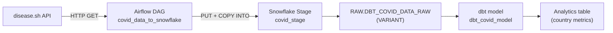

# COVID-19 Data Pipeline (Airflow + dbt + Snowflake)

Project description: A daily ELT pipeline that ingests country-level COVID-19 statistics from the [disease.sh API](https://disease.sh/), loads raw JSON into Snowflake, and transforms it into analytics-ready tables with [dbt](https://www.getdbt.com/).

## Overview

| Layer | Tool | Responsibility |
|-------|------|----------------|
| Extract & Load | Apache Airflow | Fetch API data daily and load into Snowflake as raw JSON |
| Transform | dbt (Snowflake adapter) | Flatten and model raw data into structured tables |

The pipeline is designed to run on a daily schedule. Airflow handles orchestration; dbt handles SQL-based transformations in Snowflake.

## Architecture



### Data flow

1. **Extract** — `data_extraction.py` calls `https://disease.sh/v3/covid-19/countries` and normalizes each country record into a JSON document with `country`, `stats`, and `vaccination` fields.
2. **Load** — The JSON file is uploaded to a Snowflake internal stage and copied into `DBT_COVID_DATA_RAW` as a single `VARIANT` column per row.
3. **Transform** — The dbt model `dbt_covid_model` uses `LATERAL FLATTEN` to parse the JSON and materialize columns such as `country`, `population`, `confirmed_cases`, `deaths`, `recovered`, and `vaccinated_people`.

## Repository structure

```
.
├── data_extraction_dag/          # Airflow DAG and extraction script
│   ├── airflow_dag.py            # DAG definition (daily schedule)
│   ├── data_extraction.py        # API fetch + Snowflake load logic
│   ├── Dockerfile                # Airflow service image
│   └── requirements.txt          # Python dependencies for the DAG
├── dbt_covid_data/               # dbt project
│   ├── models/example/           # SQL models and schema tests
│   ├── dbt_project.yml           # dbt project configuration
│   ├── profiles.yml.example      # Snowflake connection template
│   └── Dockerfile                # dbt service image
├── docker-compose.yml            # Local multi-service setup
└── requirements.txt              # Root-level dependency reference
```

## Prerequisites

- [Docker](https://docs.docker.com/get-docker/) and [Docker Compose](https://docs.docker.com/compose/) (recommended for local development)
- A [Snowflake](https://www.snowflake.com/) account with:
  - A warehouse, database, and schema for raw ingestion
  - A separate database/schema for dbt models (as configured in `profiles.yml`)
- Network access to `https://disease.sh`

## Configuration

### Snowflake credentials (Airflow extraction)

Edit `data_extraction_dag/data_extraction.py` and set `SNOWFLAKE_CONFIG` with your account details:

```python
SNOWFLAKE_CONFIG = {
    "user": "<your_user>",
    "password": "<your_password>",
    "account": "<your_account>",
    "warehouse": "<your_warehouse>",
    "database": "<your_database>",
    "schema": "<your_schema>",
}
```

The loader creates (or replaces) table `dbt_covid_data_raw` and stage `covid_stage` in the configured schema.

> **Security note:** Do not commit real credentials. Prefer environment variables or a secrets manager in production. See [Production considerations](#production-considerations).

### dbt profile (transformations)

Copy the example profile and fill in your Snowflake connection:

```bash
cp dbt_covid_data/profiles.yml.example ~/.dbt/profiles.yml
```

Or place `profiles.yml` inside `dbt_covid_data/` when running via Docker. The profile name must match `profile: 'dbt_covid_data'` in `dbt_project.yml`.

Update the source definition in `dbt_covid_data/models/example/schema.yml` if your raw database or schema names differ from the defaults (`DBT_PROJECT_DB.RAW.DBT_COVID_DATA_RAW`).

## Quick start (Docker Compose)

1. **Configure Snowflake** — Update `data_extraction.py` and create `profiles.yml` from the example (see [Configuration](#configuration)).

2. **Start services:**

   ```bash
   docker compose up --build
   ```

3. **Open the Airflow UI** at [http://localhost:8080](http://localhost:8080) (default credentials: `admin` / `admin`).

4. **Enable and trigger the DAG** `covid_data_to_snowflake` from the Airflow UI, or wait for the daily schedule (`@daily`).

5. **Run dbt** in the dbt container:

   ```bash
   docker compose exec dbt dbt debug    # verify connection
   docker compose exec dbt dbt run      # build models
   docker compose exec dbt dbt test     # run schema tests
   ```

## Running without Docker

### Airflow extraction

```bash
python -m venv .venv
source .venv/bin/activate
pip install -r data_extraction_dag/requirements.txt

# Run the pipeline once
python data_extraction_dag/data_extraction.py
```

To use Airflow locally, install Airflow separately and point `DAGS_FOLDER` at `data_extraction_dag/`.

### dbt transformations

```bash
cd dbt_covid_data
dbt debug
dbt run
dbt test
```

## Airflow DAG reference

| Property | Value |
|----------|-------|
| DAG ID | `covid_data_to_snowflake` |
| Schedule | `@daily` |
| Start date | 2025-10-11 |
| Catchup | `False` |
| Task | `extract_and_load_to_snowflake` → `run_pipeline()` |

The DAG uses a `SequentialExecutor` and SQLite metadata database, which is suitable for local development only.

## dbt model reference

**Source:** `raw.DBT_COVID_DATA_RAW` — raw JSON loaded by Airflow.

**Model:** `dbt_covid_model` — materialized as a table with:

| Column | Description |
|--------|-------------|
| `country` | Country name (unique, not null) |
| `population` | Population count |
| `confirmed_cases` | Total confirmed cases |
| `deaths` | Total deaths |
| `recovered` | Total recovered |
| `vaccinated_people` | People vaccinated (from source field mapping) |

Schema tests (`unique`, `not_null`) are defined on `country` in `models/example/schema.yml`.

## Production considerations

- **Secrets** — Replace hard-coded `SNOWFLAKE_CONFIG` values with environment variables or Airflow Connections/Variables.
- **Executor** — Use `LocalExecutor` or `CeleryExecutor` with a persistent metadata database (PostgreSQL) instead of SQLite.
- **Idempotency** — The current loader uses `CREATE OR REPLACE TABLE`, which overwrites raw data on each run. Consider append-only loads with ingestion timestamps for production.
- **Vaccination fields** — `total_doses` is estimated in the extraction script; `people_vaccinated` and `people_fully_vaccinated` map to API fields that may not represent true vaccination counts. Validate field mappings before using in production dashboards.
- **Scheduling** — Coordinate Airflow load completion with dbt runs (e.g., trigger dbt via Airflow `BashOperator` or an orchestration tool) so transforms run after fresh data lands.

## Troubleshooting

| Issue | Suggested fix |
|-------|----------------|
| Airflow DAG not visible | Confirm `data_extraction_dag/` is mounted to `/opt/airflow/dags` and check scheduler logs |
| Snowflake connection failed | Verify account identifier, network policy, and credentials in both `data_extraction.py` and `profiles.yml` |
| dbt source not found | Ensure the Airflow job ran successfully and `schema.yml` database/schema names match Snowflake |
| `dbt debug` fails in Docker | Mount or copy `profiles.yml` into the container at `/usr/app` or `~/.dbt/` |

## License

No license file is included in this repository. Add one before distributing or reusing this code.
